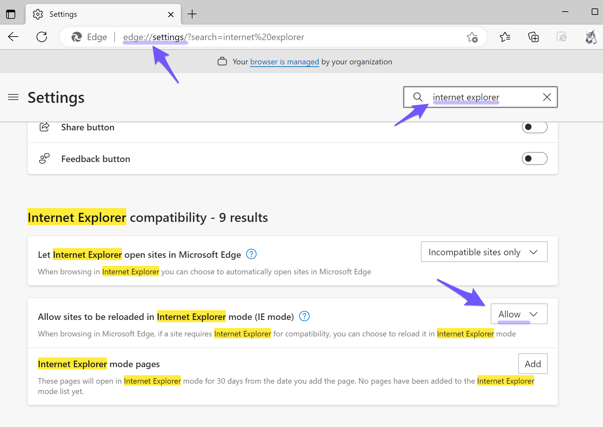
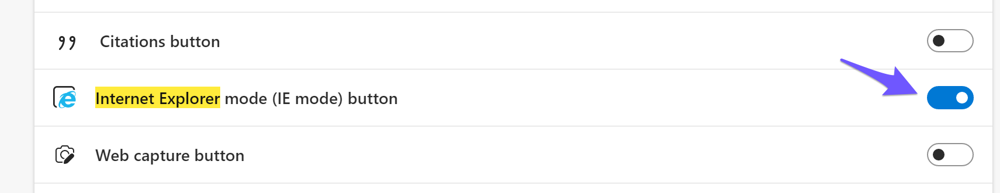
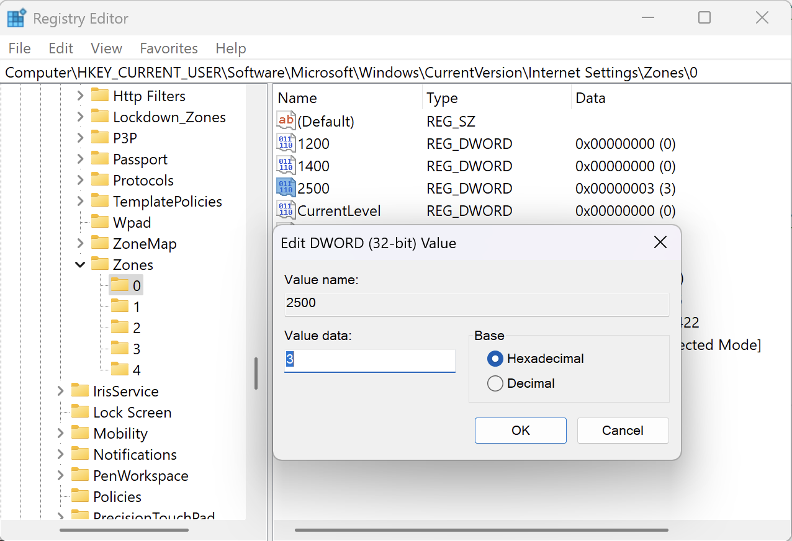
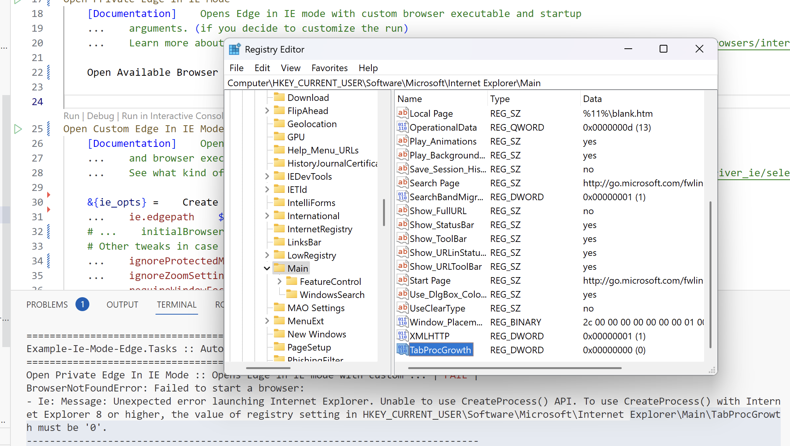

# Selenium browser automation with Edge in Internet Explorer mode

This robot demonstrates how to run your Edge browser on a Windows machine in IE mode.
This is useful for web apps that cannot run in other browsers (like Chromium Edge or
Chrome) due to compatibility issues.

## Requirements

This was tested mainly on Windows 10 and 11 by running the tasks below. On the system,
the latest Microsoft Edge (Chromium based browser) was installed and also Internet
Explorer 11 was enabled in Windows Features. We also have proofs that basic web apps
can be automated on a Windows Server 2019, even by running a Worker agent/service
through Control Room.

Please read more about the prerequisites and how to enable IE mode for Edge below:
- [What is Internet Explorer (IE) mode?](https://learn.microsoft.com/en-us/deployedge/edge-ie-mode)
- [Enable IE mode on Microsoft Edge](https://docs.oracle.com/cd/F52330_01/installation_guides/insbridge_rm_client_guide/Content/Guides_RateManager/Insbridge%20RateManager%20Client%20Setup%20Guide/Enable%20IE%20mode%20on%20Microsoft%20Edge.htm)
- [IE Driver Server configuration](https://www.selenium.dev/documentation/ie_driver_server/#required-configuration)

### Edge browser configuration for IE mode

Allow websites to use this mode

Enable button for page reload in this mode

## Tasks

1. `Open Default Edge In IE Mode`: Simplest example which opens IE with the well known
  `Open Available Browser` keyword.
2. `Open Private Edge In IE Mode`: Same as above, but this time you have the possibility
  to specify a custom MS Edge binary path along with a command line argument which will
  start the browser in private mode.
3. `Open Custom Edge In IE Mode`: You're in full control over the arguments,
  capabilities and both webdriver and browser's used executables in order to fully
  customize the run. Since the `Open Browser` keyword is used here, a webdriver has to
  be explicitly provided. (the other tasks will automatically download and use such a
  webdriver executable matching your detected browser version)

### Webdrivers selection

By default, the first two tasks are automatically downloading a webdriver adequate to
the browser and system you're using. But this happens only if the sought after
executable is not found in *PATH* (contains robot root and [bin](./bin/) directories).

- If you want to download a webdriver no matter what you have in *PATH*, simply set
  `download=${True}` to your `Open Available Browser` call.
- If you want to use your locally available one, either use the third Task (employing
  the `Open Browser` keyword call) or continue to use `Open Available Browser` with
  `download=${False}` and make sure you place the right executable name in *PATH*.
  (copy-paste the executable you'd like to use from [bin](./bin/) inside the same
  folder or robot root, then rename it into **IEDriverServer.exe** in order to be
  automatically detected and used)

> ⚠️ Don't forget to try with different versions and architectures of the webdriver in
> case you experience issues, as the implicitly downloaded one will default to
> **32bit**.

### Options

#### Protected mode

The last two tasks (**2** & **3**) are ignoring the "Protected Mode" setting in order
to make your life easier, but this may also create problems when automating a legacy
web app, therefore is advised to comment out this option and enable/disable this mode
for **all** your zones. (follow the registry based approach if you don't see the
checkbox)

> Add a `2500` DWORD key with value `3` (disabled) or `0` (enabled) and make sure it's
> set the same on **all** zones.
> 

Comment out these options once you either enabled or disabled this mode to **all** your
zones:
- Task **2**: `IE_OPTIONS.ignore_protected_mode_settings = True`
- Task **3**: `...    ignoreProtectedModeSettings    ${True}`

🔗 [How to Disable Protected Mode in Internet Explorer](https://www.lifewire.com/how-to-disable-protected-mode-in-internet-explorer-2624507)

#### Private mode

In Task **2** we experimentally run the browser in private/incognito mode and this
requires some other options (which are set already), options that attract additional
configuration under the registry.

> Add a `TabProcGrowth` DWORD key with value `0` as instructed by the error.
> 
